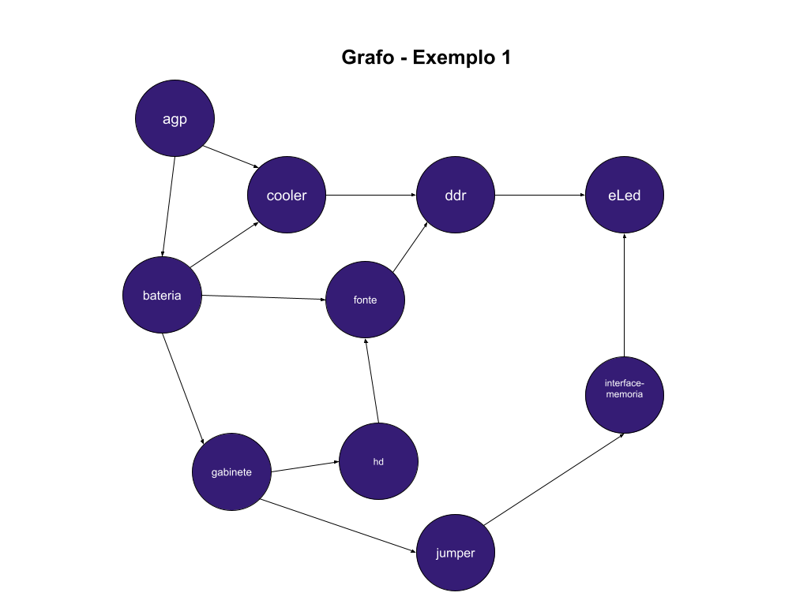
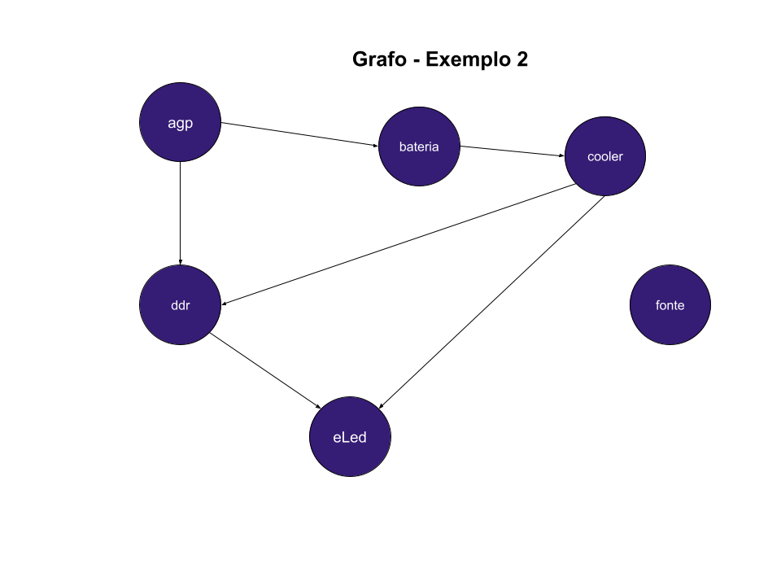
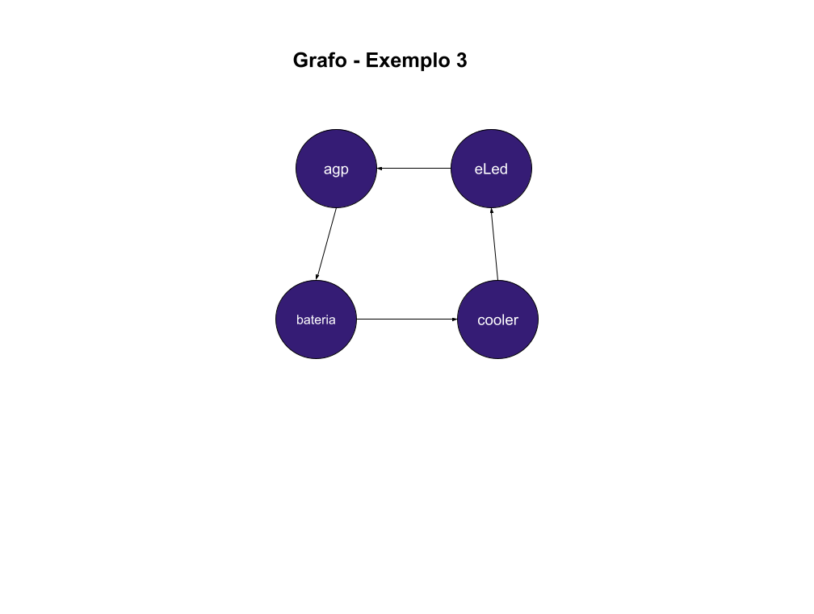

# Grafos1_LocalizaProduto

**Número da Lista**: 3 
**Conteúdo da Disciplina**: Grafos1 

## Alunos
| Matrícula | Aluno          |
|-----------|----------------|
| 17/0140717| Eduarda Tavares|
| 19/0134224| Artur Reiman   |

## Iniciando o Projeto

### Instalação do Node.js:
Antes de tudo, certifique-se de ter o Node.js instalado em seu sistema. Você pode baixá-lo do site oficial do Node.js: Node.js Downloads. Escolha a versão adequada para o seu sistema operacional e siga as instruções de instalação.

### Rodar o projeto
Após ter o Node.js instalado, siga os seguintes passos:

1. Abra o terminal e navegue até o diretório raiz do projeto, sendo representado pelo caminho Grafos1_LocalizaProduto\backend.

2. Execute o comando npm init para fazer o build do projeto.

3. Execute o comando npm start para iniciar o sistema.

4. Após aguardar a sua inicialização, você pode acessá-lo através do seu navegador, digitando o endereço do site no formato adequado ou clicando no link http://localhost:3000.

## Sobre o Projeto

Este projeto de "Localização de Produtos com Grafos" tem como objetivo principal desenvolver uma aplicação que permita gerenciar o estoque de produtos eletrônicos e visualizar as dependências entre os componentes desses produtos utilizando a teoria dos grafos. Aqui está uma descrição geral do projeto:

### Objetivo do projeto:

- Desenvolver uma aplicação para gerenciar o estoque de produtos eletrônicos.
- Visualizar as dependências entre os componentes desses produtos utilizando grafos.

### Funcionalidades principais:
- Adicionar produtos e seus componentes.
- Visualizar as dependências entre os produtos.
- Realizar a ordenação topológica dos produtos para identificar a ordem correta de produção ou montagem.

### Modelagem do grafo:

- Cada produto é representado como um nó no grafo.
- As dependências entre os produtos são representadas como arestas direcionadas de um produto para seus componentes.

### Tecnologias utilizadas:
- Node.js: Para o desenvolvimento do backend da aplicação.
- Express.js: Para a criação de rotas e endpoints da API REST.
- JavaScript: Para a lógica de programação e manipulação dos grafos.

### Fluxo de trabalho:
- O usuário adiciona produtos e seus componentes através do arquivo app.js.
- O sistema utiliza a teoria dos grafos para modelar e visualizar as dependências entre os produtos.
- A ordenação topológica é realizada para determinar a ordem correta de produção ou montagem dos produtos.

Obs.: Todos os dados de são apenas exemplos de dependecia entre componentes de um computador, ou seja, as dependências podem não ser reais.

### Benefícios:
Melhor organização e gerenciamento do estoque de produtos.
Visualização clara das dependências entre os componentes dos produtos.
Otimização do processo de produção ou montagem com base na ordenação topológica dos produtos.
Em resumo, este projeto combina conceitos de grafos com o gerenciamento de estoque de produtos eletrônicos, proporcionando uma maneira eficiente de visualizar e organizar as dependências entre os componentes dos produtos.

## Exemplos de entrada e saida

### Exemplo 1

#### Grafo:

#### Nós (vértices) e suas dependências:

- "agp"
- "bateria"
- "cooler"
- "ddr"
- "eLed"
- "fonte"
- "gabinete"
- "hd"
- "interface-memoria"
- "jumper"

#### Arestas (dependências) adicionadas:

- "agp" depende de "bateria" e "cooler".
- "bateria" depende de "gabinete", "fonte", e "cooler".
- "gabinete" depende de "jumper" e "hd".
- "jumper" depende de "interface-memoria".
- "interface-memoria" depende de "eLed".
- "hd" depende de "fonte".
- "fonte" depende de "ddr".
- "cooler" depende de "ddr".

#### Ordenação Topológica

- "agp" não tem dependências de entrada, então é colocado primeiro na ordem.
- Em seguida, vem "bateria" e "cooler", pois são as dependências diretas de "agp".
- Depois, "gabinete" é adicionado, pois é a dependência direta de "bateria".
- Então, "hd" é adicionado, pois é a dependência direta de "gabinete".
- Em seguida, "fonte" é adicionado, pois é a dependência direta de "bateria" e "hd".
- Então, "ddr" é adicionado à ordem, pois é a dependência direta de "fonte" e "cooler".
- Depois, "jumper" é adicionado, que é a dependência direta de "gabinete".
- "interface-memoria" vem em seguida, como a dependência direta de "jumper".
- Finalmente, "eLed" é colocado na ordem, pois é a dependência direta de "interface-memoria".

<b>Resultado: agp -> bateria -> cooler -> gabinete -> hd -> fonte -> ddr -> jumper -> interface-memoria -> eLed</b>

### Exemplo 2

#### Grafo:

#### Nós (vértices) e suas dependências:

- "fonte"
- "agp"
- "bateria"
- "cooler"
- "ddr"
- "eLed"

#### Arestas (dependências) adicionadas:

- "agp" depende de "bateria" e "ddr".
- "bateria" depende de "cooler".
- "ddr" depende de "eLed".
- "cooler" depende de "eLed" e "ddr".

#### Ordenação Topológica:

- "fonte" não tem dependências de entrada, então é colocado primeiro na ordem.
- Em seguida, vem "agp", pois não tem dependências de entrada.
- Depois, "bateria" é adicionada, pois é uma das dependências diretas de "agp".
- "cooler" vem em seguida, pois é a dependência direta de "bateria".
- Então, "ddr" é adicionado à ordem, pois é outra dependência direta de "agp".
- Finalmente, "eLed" é colocado na ordem, pois é a dependência direta de "ddr" e "cooler".

<b>Resultado: fonte -> agp -> bateria -> cooler -> ddr -> eLed.</b>

### Exemplo 3

#### Grafo:

#### Nós (vértices) e suas dependências:

- "agp"
- "bateria"
- "cooler"
- "eLed"

#### Arestas (dependências) adicionadas:

- "agp" depende de "bateria".
- "bateria" depende de "cooler".
- "cooler" depende de "eLed".
- "eLed" depende de "agp".

#### Ordenação Topológica:

- Não tem ordenação topológica.

## Gravação

A fim de facilitar o entendimento completo do nosso projeto foi realizado uma gravação de uso, sendo apresentado no link abaixo:

<iframe width="560" height="315" src="https://www.youtube.com/embed/-q0KGEgzpzk?si=Kkv9N2zWtDHQMMDX" title="YouTube video player" frameborder="0" allow="accelerometer; autoplay; clipboard-write; encrypted-media; gyroscope; picture-in-picture; web-share" referrerpolicy="strict-origin-when-cross-origin" allowfullscreen></iframe>